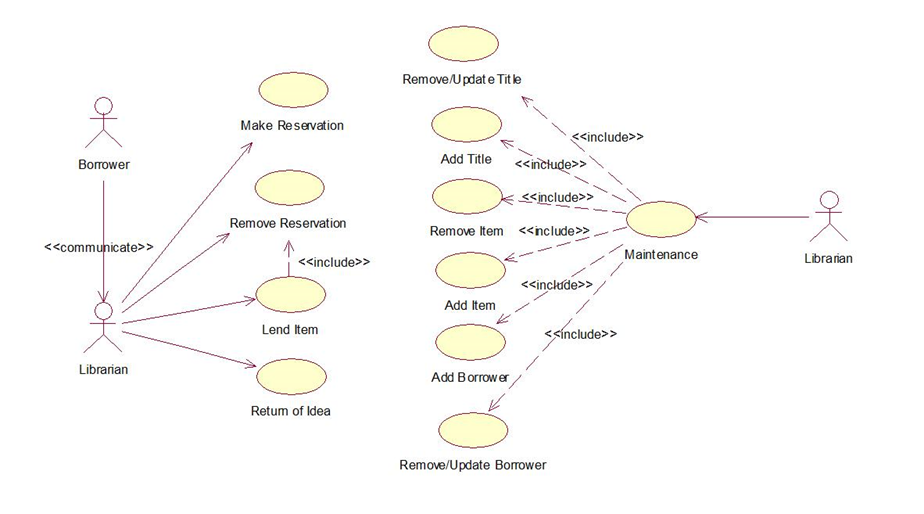
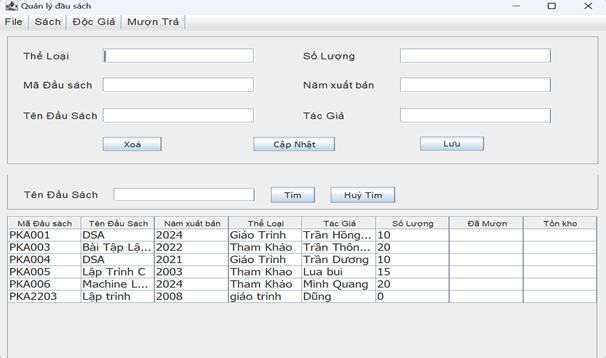
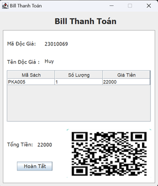
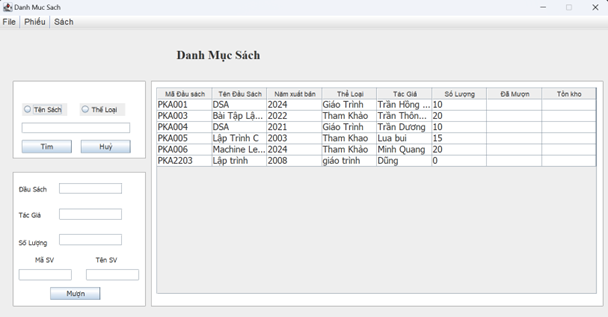
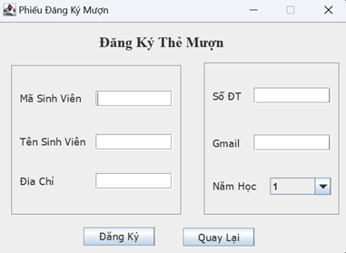

# Quản lý thư viện theo mô hình MVC JavaSwing
- Tên đề tài : Quản Lý Thư Viện.
- Ngôn ngữ backend:
- Cơ sở dữ liệu: MySQL.

# Mục lục
  1. [Hướng dẫn cài đặt](#hướng-dẫn-cài-đặt)
  2. [Các chức năng chính của chương trình](#các-chức-năng-chính-của-chương-trình)
  3. [Cấu trúc thư mục chương trình](#cấu-trúc-thư-mục-chương-trình)

# Hướng dẫn cài đặt
1, clone code từ github:

    git clone https://github.com/nguyenquangpen/QuanLyThuVienJavaMVC.git

2, cài đặt java: [java jdk 23](https://www.oracle.com/java/technologies/downloads/)

3, cài MySql: [sql](https://www.mysql.com/downloads/)

4, cài intellij idea:[intellij idea](https://www.jetbrains.com/idea/download/?section=windows)

7, tạo project maven và cập nhật pom.xml file

5, ghi file QLTV.sql vào mysql và chỉnh lại đường dẫn ở các file trong thư mục dao

6, chạy chương trình trong gói test (AppConfig)

# Các chức năng chính của chương trình

- có 2 chứ năng chính (thủ thư) và (độc giả)


  - Một số chức năng chính thủ Thư
    - Quản lý sách
    - Quản lý độc giả
    - Quản lý mượn trả sách
    - Hiện bill
    
  
  

  - Một Số chức năng chính của độc giả
    - Mượn sách
    - Trả sách
    - Xem thông tin sách
    - Đăng Ký Thẻ mượn
    
  
  
  
  - Ngoài ra còn 1 số chức năng khác như:
    - Đăng nhập, đăng xuất cho thủ thư
    - Đăng nhập, đăng xuất cho độc giả
    - Thoát
# Cấu trúc thư mục chương trình
Cấu trúc tổng quan ( là một nửa các chức năng của chương trình)

Vào thư mục src/main/java để xem chi tiết
```QuanLyThuVienJavaMVC/
├── README.md
├── pom.xml
├── src/
│   ├── main/
│   │   ├── java/
│   │   │   ├── dao/
│   │   │   │   ├── AcceptNoDao.java
│   │   │   │   ├── StudentDAO.java
│   │   │   │   ├── TransactionDao.java
│   │   │   ├── model/
│   │   │   │   ├── AcceptNo.java
│   │   │   │   ├── Student.java
│   │   │   │   ├── Transaction.java
│   │   │   ├── view/
│   │   │   │   ├── AcceptNoView.java
│   │   │   │   ├── BillView.java
│   │   │   │   ├── QLSachView.java
│   │   │   │   ├── StudentView.java
│   │   │   │   ├── TransactionView.java
│   │   │   ├── controller/
│   │   │   │   ├── TransactionController.java
│   │   ├── resources/
│   │   │   ├── db_config.properties
│   ├── test/
│   │   ├── java/
│   │   │   ├── AppConfig.java
│   │   │   ├── TestAcceptNo.java
